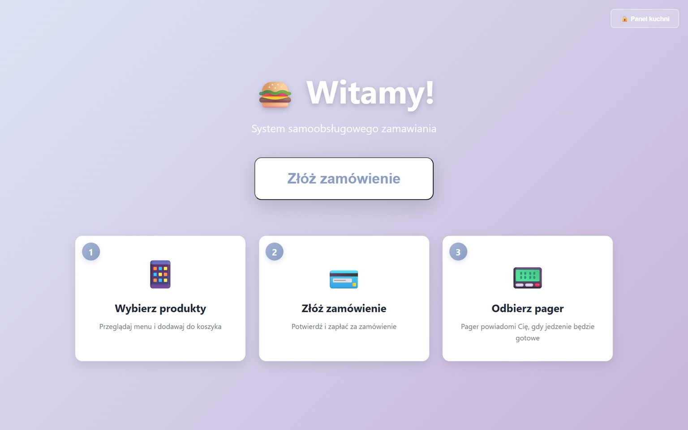
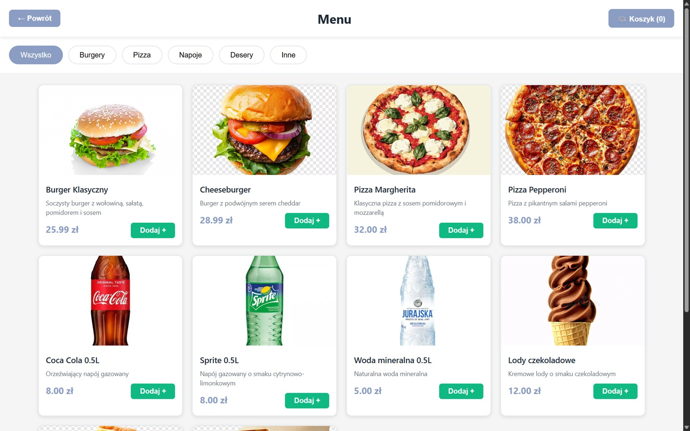
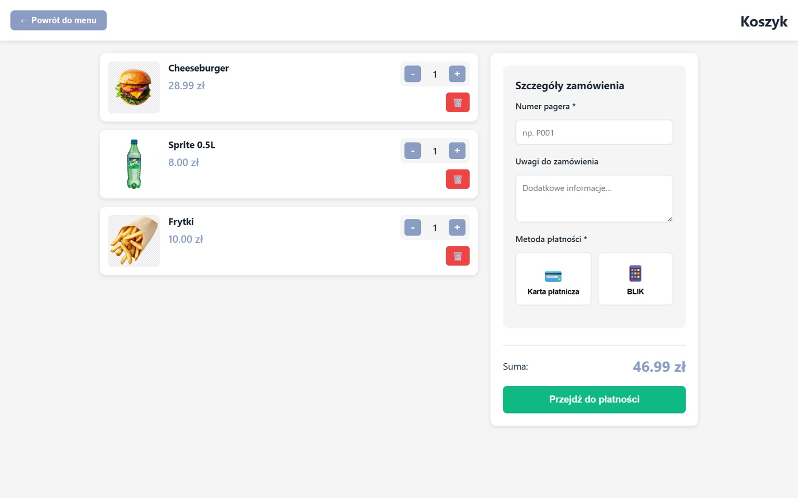
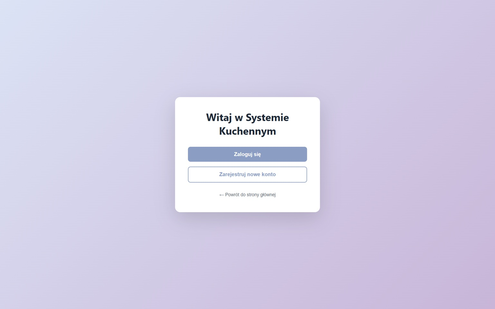
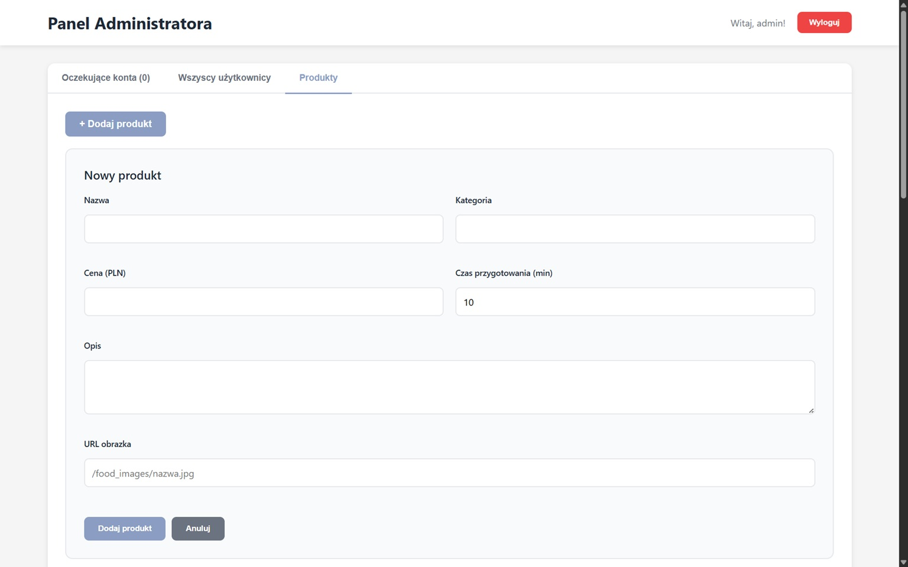

# Food Ordering System

Fullstack system samoobsługowego zamawiania jedzenia z integracją IoT — pagery ESP32 powiadamiają klientów o gotowości zamówienia w czasie rzeczywistym.



## Funkcjonalności

- Przeglądanie menu i składanie zamówień bez konta
- Panel kuchenny (real-time, WebSocket) — kucharz zmienia status zamówień
- Pager ESP32 z wyświetlaczem OLED: buzzer + LED sygnalizują gotowość zamówienia
- System kont z rolami (admin / kucharz) — admin akceptuje nowych kucharzy
- Panel admina: zarządzanie użytkownikami i produktami

## Architektura

```
┌─────────────┐     HTTP/WS      ┌──────────────────┐     MongoDB
│  Frontend   │ ◄──────────────► │     Backend      │ ◄──────────►
│  React/Vite │                  │  Express + WS    │
└─────────────┘                  └──────────────────┘
                                          │ WebSocket
                                          ▼
                                 ┌──────────────────┐
                                 │   ESP32 Pager    │
                                 │  OLED + Buzzer   │
                                 └──────────────────┘
```

## Stack technologiczny

| Warstwa | Technologie |
|---------|-------------|
| Frontend | React 19, Vite, React Router |
| Backend | Node.js, Express, WebSocket (ws) |
| Baza danych | MongoDB, Mongoose |
| Hardware | ESP32, PlatformIO, WebSockets, ArduinoJson |
| Wyświetlacz | OLED SH1106 (ThingPulse) |
| Auth | JWT, bcrypt |

## Zrzuty ekranu

### Aplikacja klienta

| Menu | Koszyk |
|------|--------|
|  |  |

### Panel kuchenny



### Panel admina



### Pager ESP32 — stany urządzenia

| Oczekiwanie | W trakcie realizacji | Gotowe! |
|-------------|----------------------|---------|
|  |  |  |


## Uruchomienie

### Wymagania
- Node.js 18+
- MongoDB
- (opcjonalnie) ESP32 z PlatformIO do pagerów

### Backend

```bash
cd backend
cp .env.example .env
# Uzupełnij JWT_SECRET i MONGODB_URI w .env
npm install
npm run dev
```

### Frontend

```bash
cd frontend
cp .env.example .env
npm install
npm run dev
```

### ESP32 Pager

```bash
cd pager-esp32/src
cp secrets.h.example secrets.h
# Uzupełnij WIFI_SSID, WIFI_PASSWORD i BACKEND_IP w secrets.h
# Wgraj przez PlatformIO
```

## Struktura projektu

```
food-ordering-system/
├── backend/          # Express API + WebSocket server
│   └── src/
│       ├── controllers/
│       ├── models/
│       ├── routes/
│       ├── middleware/
│       └── services/
├── frontend/         # React SPA
│   └── src/
│       ├── pages/
│       ├── context/
│       └── services/
├── pager-esp32/      # Firmware ESP32 (PlatformIO)
│   └── src/
│       └── main.cpp
├── docs/             # Dokumentacja, diagramy, ERD
└── screens/          # Zrzuty ekranu i zdjęcia urządzenia
```

## Autor

Filip — student Inżynierii Systemów Inteligentnych, 3. rok  
[GitHub](https://github.com/wojtas-it)
